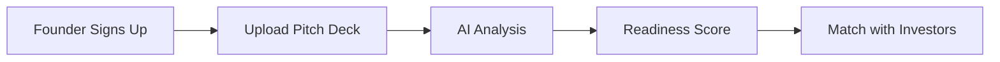

# [Project Name] Architecture Snapshot
**Date:** [YYYY-MM-DD]
**Version:** [semantic version]
**Status:** [production|development|archived]

---

## 1. PROJECT OVERVIEW

### Core Purpose
[2-3 sentences describing what this application does]

### User Types & Roles
| Role | Description | Key Permissions |
|------|-------------|-----------------|
| founder | Entrepreneurs seeking funding | Upload decks, view analysis |
| investor | People providing capital | View founders, manage profiles |
| admin | Platform administrators | Manage users, delete content |
| superadmin | System administrators | Full access, view metrics |

### Key Workflows


---

## 2. DIRECTORY STRUCTURE

### Complete Tree
```
[Paste output of tree command or Python script]
```

### Critical Paths (Annotated)
```
app/
├── (auth)/                    # 🔐 Authentication flows
│   ├── login/
│   └── signup/
│       ├── founder/           # Founder-specific signup
│       └── investor/          # Investor-specific signup
├── api/                       # 🔌 API Routes
│   ├── coaching/              # AI coaching endpoints
│   │   ├── chat/             # Conversational AI
│   │   └── start/            # Session initialization
│   ├── deck/                  # Pitch deck processing
│   │   ├── analyze/          # ⭐ CORE: AI analysis
│   │   └── upload/           # File handling
│   └── founder-discovery/     # ⭐ CORE: Discovery flow
├── founder/                   # 📱 Founder portal
│   ├── dashboard/            # ⭐ Main UI
│   ├── discovery/            # ⭐ AI-coached discovery
│   ├── profile/
│   └── upload/
└── investor/                  # 💼 Investor portal
    ├── dashboard/
    ├── discovery/            # ⭐ Investor criteria setting
    └── profile/

components/
├── coaching/
│   └── coaching-chat.tsx     # ⭐ CLONE: AI conversation UI
├── deck/
│   ├── deck-preview.tsx      # ⭐ CLONE: File preview
│   └── deck-upload.tsx       # ⭐ CLONE: Upload component
└── ui/                        # ✅ CLONE ALL: shadcn/ui components

lib/
├── ai/                        # ⭐⭐⭐ CRITICAL TO CLONE
│   ├── anthropic.ts          # Claude API wrapper
│   ├── extraction.ts         # Data extraction from responses
│   └── prompts.ts            # Prompt templates
├── supabase/                  # ✅ CLONE: Database client
│   ├── client.ts
│   └── server.ts
└── pdf/                       # 📄 PDF processing (may not need)

hooks/
├── use-coaching-session.ts    # ⭐ CLONE & ADAPT
└── use-auth.ts               # ✅ CLONE
```

### Legend
- ⭐⭐⭐ = Must clone exactly
- ⭐⭐ = Clone and adapt
- ⭐ = Reference for patterns
- ✅ = Clone as-is
- 📄 = Evaluate if needed
- 🚫 = Do not clone (domain-specific)

---

## 3. DATABASE SCHEMA

### Tables Overview
| Table | Purpose | Clone Status | SDA Equivalent |
|-------|---------|--------------|----------------|
| `founders` | User profiles for entrepreneurs | ✅ Clone structure | `participants` |
| `investors` | User profiles for investors | 🚫 Skip | N/A |
| `pitch_decks` | Uploaded decks & analysis | ⭐ Adapt | `designs` |
| `coaching_sessions` | AI conversation sessions | ✅ Clone exactly | `sda_sessions` |
| `founder_profiles` | Extended founder data | ⭐ Adapt | `participants` (merged) |
| `deck_analysis` | AI analysis results | ⭐ Adapt | `compliance_status` |
| `watchlist_alerts` | Notification system | ✅ Clone pattern | `design_notifications` |

### Key Schema Patterns

#### ✅ CLONE: Session Management
```sql
CREATE TABLE coaching_sessions (
  id UUID PRIMARY KEY,
  user_id UUID REFERENCES users(id),
  session_type TEXT,               -- 'founder_discovery' | 'investor_criteria'
  current_step INT,
  conversation_data JSONB,         -- ⭐ Stores all AI exchanges
  created_at TIMESTAMP,
  updated_at TIMESTAMP
);
```
**SDA Adaptation:**
```sql
CREATE TABLE sda_sessions (
  id UUID PRIMARY KEY,
  user_id UUID REFERENCES users(id),
  current_phase TEXT,              -- 'assessment' | 'site' | 'design'
  current_step INT,
  conversation_data JSONB,         -- ⭐ Same pattern
  assessment_data JSONB,           -- ⭐ Extracted participant data
  created_at TIMESTAMP,
  updated_at TIMESTAMP
);
```

#### ✅ CLONE: User Roles
```sql
-- RaiseReady pattern
CREATE TYPE user_role AS ENUM ('founder', 'slyds', 'admin', 'superadmin');
```
**SDA Adaptation:**
```sql
CREATE TYPE user_role AS ENUM ('participant', 'ot', 'family', 'admin', 'superadmin');
```

#### ✅ CLONE: RLS Patterns
```sql
-- Pattern: Users can only see their own data
CREATE POLICY "Users can view own sessions"
  ON coaching_sessions FOR SELECT
  USING (auth.uid() = user_id);

-- Pattern: Admins bypass RLS
CREATE POLICY "Superadmins can manage sessions"
  ON coaching_sessions FOR ALL
  USING (is_superadmin(auth.uid()));
```

### Database Functions
| Function | Purpose | Clone? |
|----------|---------|--------|
| `handle_new_user` | Auto-create profile on signup | ✅ Yes |
| `update_updated_at_column` | Timestamp trigger | ✅ Yes |
| `is_superadmin()` | Check admin status | ✅ Yes |
| `calculate_founder_impact_return()` | Business-specific | 🚫 No |

---

## 4. COMPONENT INVENTORY

### 🔥 High Priority Clones

#### **1. AI Conversation Components**
```typescript
// components/coaching/coaching-chat.tsx
// ⭐⭐⭐ MUST CLONE

Interface: ConversationFlowProps {
  sessionId: string
  onComplete: (data: any) => void
}

Key Features:
- Progressive disclosure (one question at a time)
- Auto-save after each response
- Resume capability
- AI response parsing
- Structured data extraction

Dependencies:
- @anthropic-ai/sdk
- lib/ai/anthropic.ts
- hooks/use-coaching-session.ts

Clone Notes:
- Change prompts from business to SDA context
- Keep conversation flow logic identical
- Maintain auto-save pattern
```

#### **2. File Upload Components**
```typescript
// components/deck/deck-upload.tsx
// ⭐⭐ CLONE & ADAPT

Interface: DeckUploadProps {
  onUploadComplete: (fileUrl: string) => void
  acceptedFormats: string[]
}

Key Features:
- Drag & drop
- File validation
- Progress indicator
- Supabase storage integration

Clone Notes:
- Adapt for site plans, OT reports instead of pitch decks
- Keep upload mechanism identical
```

#### **3. Authentication Provider**
```typescript
// app/providers/AuthProvider.tsx
// ✅ CLONE EXACTLY

Provides:
- User session management
- Role-based access
- Redirect logic

Dependencies:
- @supabase/auth-helpers-nextjs
```

### 📋 Component Clone Matrix

| Component | Location | Clone Status | SDA Destination | Modification Level |
|-----------|----------|--------------|-----------------|-------------------|
| `coaching-chat.tsx` | `components/coaching/` | ✅ Clone | `components/assessment/` | Prompts only |
| `deck-upload.tsx` | `components/deck/` | ⭐ Adapt | `components/upload/` | File types |
| `deck-preview.tsx` | `components/deck/` | ⭐ Adapt | `components/preview/` | Minimal |
| `readiness-score.tsx` | `components/report/` | 🚫 Skip | N/A | Domain-specific |
| All `components/ui/*` | `components/ui/` | ✅ Clone all | `components/ui/` | None |
| `filter-sidebar.tsx` | `components/shared/` | ✅ Clone | `components/shared/` | None |

---

## 5. API ENDPOINTS

### Endpoint Inventory

#### ✅ CLONE EXACTLY
```typescript
// app/api/coaching/start/route.ts
POST /api/coaching/start
Request: { userId: string, sessionType: string }
Response: { sessionId: string, firstQuestion: string }

Purpose: Initialize AI coaching session
Dependencies: lib/ai/anthropic.ts, Supabase
Clone Notes: Change sessionType values
```
```typescript
// app/api/coaching/chat/route.ts
POST /api/coaching/chat
Request: { sessionId: string, userResponse: string }
Response: { nextQuestion: string, extractedData: object, complete: boolean }

Purpose: Process AI conversation turn
Dependencies: lib/ai/extraction.ts
Clone Notes: ⭐⭐⭐ This is CORE - keep logic, change prompts
```

#### 🚫 SKIP (Domain-Specific)
```typescript
// app/api/match-investors/route.ts
// RaiseReady-specific matching algorithm
```

### API Clone Map
| RaiseReady Endpoint | SDA Designer Equivalent | Changes Needed |
|---------------------|-------------------------|----------------|
| `/api/coaching/start` | `/api/assessment/start` | sessionType values |
| `/api/coaching/chat` | `/api/assessment/chat` | Prompt templates |
| `/api/deck/upload` | `/api/upload/site-plan` | File validation |
| `/api/deck/analyze` | `/api/design/validate` | Analysis logic (full rewrite) |
| `/api/match-investors` | N/A | Skip entirely |

---

## 6. LIBRARY CODE (lib/)

### 🔥 Critical to Clone

#### **lib/ai/anthropic.ts**
```typescript
// ⭐⭐⭐ MUST CLONE EXACTLY

export async function generateAIResponse(
  messages: Message[],
  systemPrompt: string
): Promise<string> {
  // Claude API call wrapper
  // Handles retries, error formatting, token management
}

Clone Status: ✅ Exact clone
Modifications: None (just import and use)
```

#### **lib/ai/extraction.ts**
```typescript
// ⭐⭐ CLONE & ADAPT

export function extractStructuredData(
  aiResponse: string,
  schema: z.ZodSchema
): ExtractedData {
  // Parses AI response into typed data
  // Uses Zod for validation
}

Clone Status: ✅ Clone logic
Modifications: Update Zod schemas for SDA data
```

#### **lib/ai/prompts.ts**
```typescript
// ⭐ REFERENCE ONLY

export const FOUNDER_DISCOVERY_PROMPTS = {
  welcome: "Tell me about your business...",
  // ... more prompts
}

Clone Status: 🔄 Create SDA version
New File: lib/ai/sda-prompts.ts
```

#### **lib/supabase/client.ts**
```typescript
// ✅ CLONE EXACTLY

export const createClientComponentClient = () => {
  return createClient(
    process.env.NEXT_PUBLIC_SUPABASE_URL!,
    process.env.NEXT_PUBLIC_SUPABASE_ANON_KEY!
  )
}

Clone Status: ✅ Exact (works for both apps)
```

### Library Clone Checklist
- [x] `lib/ai/anthropic.ts` → Clone exactly
- [x] `lib/ai/extraction.ts` → Clone & adapt schemas
- [x] `lib/ai/prompts.ts` → Create new `sda-prompts.ts`
- [x] `lib/supabase/client.ts` → Clone exactly
- [x] `lib/supabase/server.ts` → Clone exactly
- [ ] `lib/pdf/extractor.ts` → Evaluate if needed
- [ ] `lib/scoring/` → Skip (domain-specific)

---

## 7. HOOKS

### Custom React Hooks

#### ✅ CLONE
```typescript
// hooks/use-coaching-session.ts
// ⭐⭐ CLONE & ADAPT

export function useCoachingSession(sessionId?: string) {
  // Manages conversation state
  // Handles auto-save
  // Tracks progress
  
  return {
    messages,
    sendMessage,
    isLoading,
    progress,
    extractedData
  }
}

Clone To: hooks/use-assessment-session.ts
Changes: Variable names only
```
```typescript
// hooks/use-auth.ts
// ✅ CLONE EXACTLY

export function useAuth() {
  // Wraps Supabase auth
  // Provides user, signIn, signOut, etc.
}

Clone To: hooks/use-auth.ts (same)
Changes: None
```

#### 🚫 SKIP
```typescript
// hooks/useVoiceCoach.ts
// Voice coaching feature - not needed for SDA
```

---

## 8. CONFIGURATION FILES

### Clone These Exactly
```json
// components.json (shadcn/ui config)
✅ Clone → Identical UI component setup

// tailwind.config.ts
✅ Clone → Keep design system consistent

// tsconfig.json
✅ Clone → TypeScript settings

// next.config.js
✅ Clone → Check for any custom webpack config
```

### Adapt These
```json
// package.json
⭐ Adapt → Same dependencies, different name/description

// .env.local (template)
⭐ Adapt → Same variables, different values

// vercel.json
⭐ Adapt → Deployment config
```

---

## 9. KEY PATTERNS TO REPLICATE

### Pattern 1: Progressive Disclosure Conversation
```typescript
// RaiseReady Pattern
const DISCOVERY_FLOW = [
  { id: 'welcome', question: "Tell me about your business" },
  { id: 'problem', question: "What problem are you solving?" },
  { id: 'market', question: "Who are your customers?" }
]

// SDA Adaptation
const ASSESSMENT_FLOW = [
  { id: 'welcome', question: "Let's design your home together" },
  { id: 'mobility', question: "How do you move around?" },
  { id: 'independence', question: "What activities do you want to do yourself?" }
]
```

### Pattern 2: Auto-Save on Every Change
```typescript
// RaiseReady Pattern (CLONE EXACTLY)
useEffect(() => {
  const timer = setTimeout(() => {
    saveToDatabase(sessionData)
  }, 1000)
  return () => clearTimeout(timer)
}, [sessionData])
```

### Pattern 3: Role-Based Routing
```typescript
// RaiseReady Pattern
export default async function Page() {
  const user = await getUser()
  
  if (user.role === 'founder') redirect('/founder/dashboard')
  if (user.role === 'slyds') redirect('/investor/dashboard')
  
  return <LandingPage />
}

// SDA Adaptation
export default async function Page() {
  const user = await getUser()
  
  if (user.role === 'participant') redirect('/participant/dashboard')
  if (user.role === 'ot') redirect('/ot/portal')
  
  return <LandingPage />
}
```

### Pattern 4: JSONB for Flexible Data
```sql
-- RaiseReady Pattern (CLONE)
conversation_data JSONB -- Stores all messages, responses, extracted data
```

---

## 10. MIGRATION CHECKLIST

### Phase 1: Foundation (Week 1)
- [ ] Clone `lib/supabase/*` → Test connection
- [ ] Clone `hooks/use-auth.ts` → Test auth flow
- [ ] Clone `components/ui/*` → Verify UI library
- [ ] Clone `app/providers/` → Test context providers
- [ ] Create database schema based on RR patterns

### Phase 2: Core AI Logic (Week 2)
- [ ] Clone `lib/ai/anthropic.ts` → Test Claude API
- [ ] Clone `lib/ai/extraction.ts` → Test data parsing
- [ ] Create `lib/ai/sda-prompts.ts` → SDA-specific prompts
- [ ] Clone `hooks/use-coaching-session.ts` → Adapt to `use-assessment-session.ts`
- [ ] Clone `components/coaching/coaching-chat.tsx` → Adapt to SDA

### Phase 3: API Routes (Week 3)
- [ ] Clone `/api/coaching/start` → `/api/assessment/start`
- [ ] Clone `/api/coaching/chat` → `/api/assessment/chat`
- [ ] Clone auto-save logic
- [ ] Test end-to-end conversation flow

### Phase 4: UI Pages (Week 4)
- [ ] Clone `/founder/dashboard` → `/participant/dashboard`
- [ ] Clone `/founder/discovery` → `/assessment`
- [ ] Adapt profile pages
- [ ] Build SDA-specific pages (site intelligence, design canvas)

---

## 11. TESTING CHECKLIST

### Core Functionality Tests
```typescript
// Test 1: Authentication Flow
✅ Sign up as new user
✅ Receive magic link email
✅ Login successfully
✅ Role assigned correctly

// Test 2: AI Conversation
✅ Start new session
✅ Send first response
✅ Receive AI question
✅ Auto-save triggers
✅ Resume from saved state
✅ Complete full flow
✅ Data extracted correctly

// Test 3: Database Operations
✅ Session created in DB
✅ Messages stored in JSONB
✅ RLS policies enforced
✅ Timestamps updated
```

---

## 12. DEPLOYMENT NOTES

### Environment Variables
```bash
# Required (from RaiseReady)
NEXT_PUBLIC_SUPABASE_URL=
NEXT_PUBLIC_SUPABASE_ANON_KEY=
SUPABASE_SERVICE_ROLE_KEY=
ANTHROPIC_API_KEY=

# SDA-Specific additions
GOOGLE_MAPS_API_KEY=           # For site intelligence
NEXT_PUBLIC_MAPBOX_TOKEN=      # For site visualization
```

### Vercel Configuration
```json
{
  "buildCommand": "next build",
  "devCommand": "next dev",
  "installCommand": "npm install",
  "framework": "nextjs"
}
```

---

## 13. DOCUMENTATION REFERENCES

### RaiseReady-Specific Docs to Reference
- [ ] Conversation flow logic: `/app/api/coaching/`
- [ ] Database schema: `/supabase/migrations/`
- [ ] Component patterns: `/components/coaching/`

### Create for SDA Designer
- [ ] SDA conversation prompts documentation
- [ ] Compliance checking rules documentation
- [ ] Site intelligence API integration guide
- [ ] Design canvas technical spec

---

## APPENDIX: Clone Quick Reference

| What | From (RaiseReady) | To (SDA Designer) | Action |
|------|-------------------|-------------------|--------|
| Auth | `app/(auth)/` | `app/(auth)/` | ✅ Copy |
| AI Core | `lib/ai/` | `lib/ai/` | ✅ Copy + Adapt prompts |
| Conversation UI | `components/coaching/coaching-chat.tsx` | `components/assessment/assessment-chat.tsx` | ✅ Copy + Rename |
| Database Client | `lib/supabase/` | `lib/supabase/` | ✅ Copy |
| Hooks | `hooks/use-coaching-session.ts` | `hooks/use-assessment-session.ts` | ✅ Copy + Rename |
| UI Components | `components/ui/` | `components/ui/` | ✅ Copy all |
| API Routes | `app/api/coaching/` | `app/api/assessment/` | ✅ Copy + Adapt |

---

**END OF SNAPSHOT**